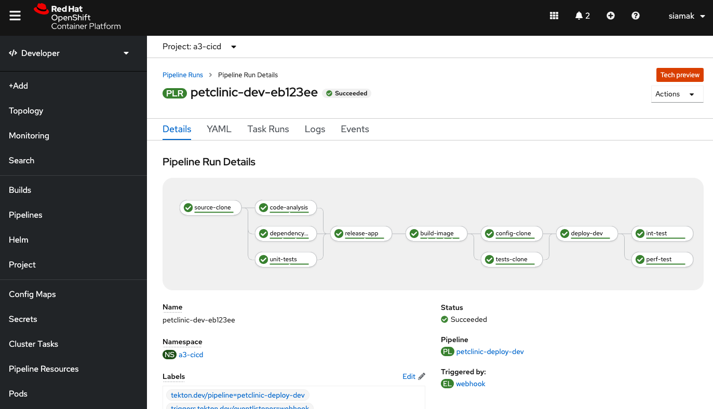

# CI/CD Demo with Tekton Pipelines

This repo is a sample [Tekton](http://www.tekton.dev) pipeline that builds and deploys the [Spring PetClinic](https://github.com/spring-projects/spring-petclinic) sample Spring Boot application on OpenShift. This demo pre-configures Gogs git server, Sonatype Nexuas and SonarQube which are all used by the Tekton pipeline.

On every push to the `spring-petclinic` git repository on Gogs git server, the following steps are executed within the pipeline:

1. Code is cloned from Gogs and the unit-tests are run
1. Application is packaged as a JAR and pushed to Sonatype Nexus snapshot repository
1. A container image (_spring-petclinic:latest_) is built using the [Source-to-Image](https://github.com/openshift/source-to-image) for Java apps, and pushed to OpenShift internal registry
1. In parallel to building the image, the code is analysed by SonarQube for anti-patterns, code coverage and potential bugs
1. Application image is deployed with a rolling update


# Deploy

1. Get an OpenShift cluster via https://try.openshift.com

2. Install OpenShift Pipelines Operator

3. Download [OpenShift CLI](https://mirror.openshift.com/pub/openshift-v4/clients/ocp/latest/), [Tekton CLI](https://github.com/tektoncd/cli/releases) and [Kustomize](https://github.com/kubernetes-sigs/kustomize/releases/tag/kustomize%2Fv3.4.0)

3. Deploy the demo

  ```
  $ oc new-project demo

  $ git clone https://github.com/siamaksade/tekton-cd-demo 
  $ install.sh  # deploy demo
  $ run.sh      # start pipeline
  ```





## TODO

* Create `PipelineResource`s for Gogs git repo and image in internal registry
* Create embedded `PipelineResource`s with triggers
* Fix SonarQube empty reports